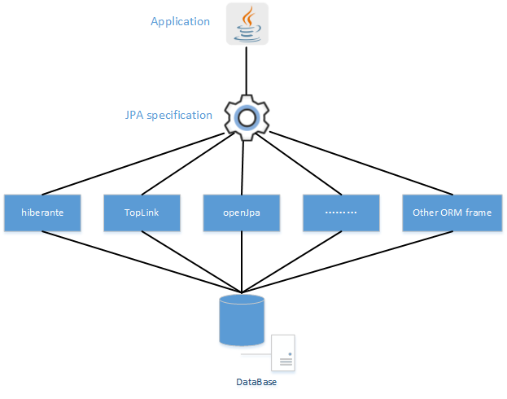

[官网](https://spring.io/projects/spring-data-jpa)


#### 查询策略
##### CREATE
    根据方法名字生成sql语句，比如
````$xslt
interface PersonRepository extends Repository<User, Long> {

  List<Person> findByEmailAddressAndLastname(EmailAddress emailAddress, String lastname);

  // Enables the distinct flag for the query
  List<Person> findDistinctPeopleByLastnameOrFirstname(String lastname, String firstname);
  List<Person> findPeopleDistinctByLastnameOrFirstname(String lastname, String firstname);

  // Enabling ignoring case for an individual property
  List<Person> findByLastnameIgnoreCase(String lastname);
  // Enabling ignoring case for all suitable properties
  List<Person> findByLastnameAndFirstnameAllIgnoreCase(String lastname, String firstname);

  // Enabling static ORDER BY for a query
  List<Person> findByLastnameOrderByFirstnameAsc(String lastname);
  List<Person> findByLastnameOrderByFirstnameDesc(String lastname);
}
````
##### USE_DECLARED_QUERY
    用户声明sql语句
##### CREATE_IF_NOT_FOUND
    默认查询策略，先查找是否有声明的sql语句，如果没有，根据方法名称生成
